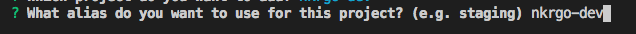

# Nk

## Configurar Firebase
1. Instalar Firebase Tools
2. Ejecutar comando `firebase login` e ingresar crenciales
3. En el archivo package.jso en la seccion de scripts adicionar a los alias lo digitos NG.
 
4. Ejecutar comando `firebase init` 
> *??*
  + Seleccion en todas las opciones
  
> *??*
  + Seleccione el entorno de produccion de firebase
  
> *??*
  + Aceptar la configuracion por defecto para definir las reglas por firestore. `Enter`
  
> *??*
  + Aceptar la configuracion por defecto para definir los indices por firestore. `Enter`
  
> *??*
  + Aceptar el uso del TSLint en el proyecto. `Enter`
  
> *??*
  + Aceptar que se instalen las dependencias con npm. `Enter`
  
> *??*
  + Aceptar el uso de una carpeta public. `Enter`
  
> *??*
  + Aceptar la configuracion por defecto de una single page app. `Enter`
  
> *??*
+ Aceptar la configuracion por defecto para definir los reglas de almacenamiento. `Enter`
  

### Anadir otros entornos al proyecto
1. Ejecutar comando `firebase use --add`
2. Seleccionar el entorno a integrar. `Enter`
  
3. Poner un alias `enter`

